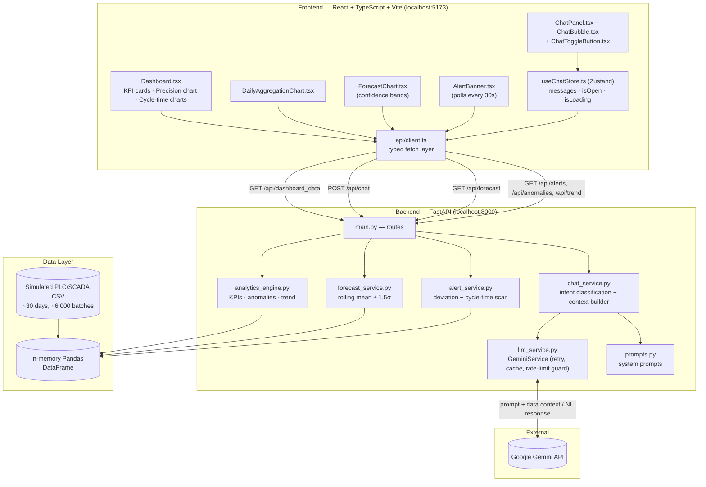
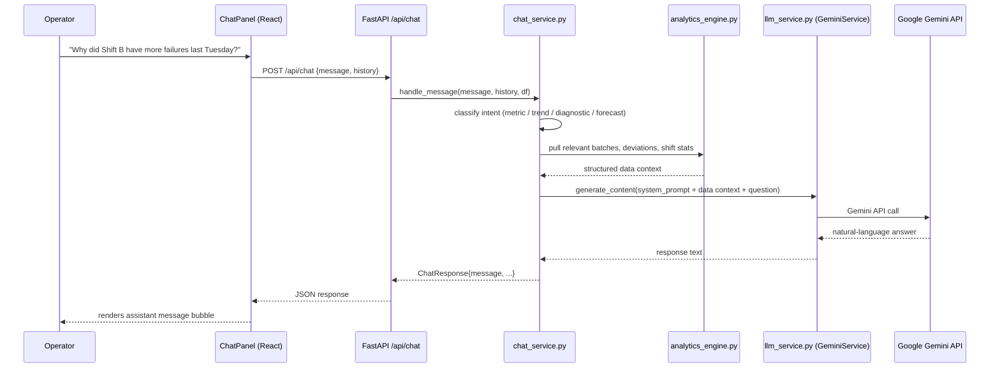
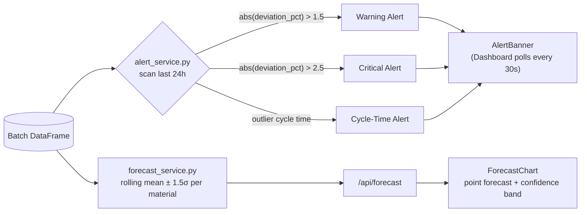
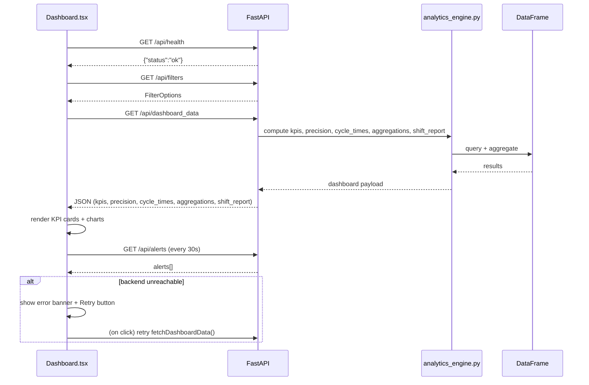

# BF Stockhouse Analytics — AI-Powered Blast Furnace Operations Platform

> An agentic, AI-augmented analytics dashboard for blast furnace stockhouse operations — combining real-time process analytics, conversational (LLM) insight generation, forecasting, and automated anomaly alerting.

**Stack:** FastAPI (Python) · React + TypeScript + Vite · Tailwind CSS · Google Gemini · Recharts · Zustand

---

## Table of Contents

1. [Business Problem Statement](#1-business-problem-statement)
2. [Solution Overview](#2-solution-overview)
3. [What This Platform Does](#3-what-this-platform-does)
4. [System Architecture](#4-system-architecture)
5. [How It Works — Workflows](#5-how-it-works--workflows)
6. [Data Model](#6-data-model)
7. [API Reference](#7-api-reference)
8. [Project Structure](#8-project-structure)
9. [Getting Started](#9-getting-started)
10. [Configuration](#10-configuration)
11. [Verification / Smoke Tests](#11-verification--smoke-tests)
12. [Current Limitations](#12-current-limitations)
13. [Roadmap — Where This Is Headed](#13-roadmap--where-this-is-headed)
14. [License](#14-license)

---

## 1. Business Problem Statement

A blast furnace stockhouse charges raw materials — **Coke, Sinter, Pellet, Limestone, and Ore** — into the furnace via a set of hoppers (H1–H4), around the clock, across three rotating shifts (A, B, C). Every batch has a **target weight**; the difference between target and actual weight (the *deviation*) directly affects furnace stoichiometry, fuel efficiency, and ultimately hot metal quality. Cycle time (fill + discharge) determines how much material can be charged per hour, which caps furnace throughput.

In a typical plant, this operational data lives in disconnected PLC/SCADA historians and spreadsheet exports. That creates several recurring problems:

| Problem | Operational Impact |
|---|---|
| **No unified, real-time view** of KPIs, precision, cycle time, and shift performance | Supervisors react to problems hours or shifts after they occur |
| **Insight requires SQL/Excel skills** | Domain experts (shift engineers, operators) depend on data analysts to answer simple questions |
| **No proactive anomaly detection** | Out-of-tolerance batches (>±0.5% deviation) are discovered during manual shift-end review, not in real time |
| **No forward-looking view** | Material staging, inventory pull, and maintenance windows are planned reactively, not predictively |
| **Root-cause analysis is manual and slow** | Diagnosing *why* Shift B underperformed on a given day can take a manual data pull and cross-referencing multiple logs |
| **Legacy dashboard (Phase 1)** only showed static charts | No way to ask a follow-up question, drill into an anomaly, or get an explanation in plain language |

**Business objective:** Give operators, shift supervisors, and plant managers a single system where they can *see* the data (dashboard), *ask* the data questions in plain English (AI assistant), *anticipate* what's coming (forecasting), and *get warned* before a shift-ending anomaly becomes a quality incident (automated alerting) — without needing to write a query or wait for a report.

---

## 2. Solution Overview

**BF Stockhouse Analytics** upgrades a Phase-1 static analytics dashboard into an AI-powered operations copilot, in five delivered phases:

| Phase | Capability Delivered |
|---|---|
| **Phase 1 — Foundation** | Fixed dashboard gaps: retry-able error handling, Cycle Time by Shift chart, Daily Aggregation chart, refreshed header/branding |
| **Phase 2 — LLM Integration** | Wired Google **Gemini** into the backend (`llm_service.py`) with prompt templates for analytics, forecasting, and diagnostics |
| **Phase 3 — AI Chatbot Assistant** | A conversational side-panel (`ChatPanel.tsx`) backed by `POST /api/chat`, so any user can ask operational questions in natural language and get answers grounded in the live dataset |
| **Phase 4 — Anomaly Alerting** | `alert_service.py` continuously scans recent batches for deviation and cycle-time outliers and surfaces them as an `AlertBanner`, polled every 30 seconds |
| **Phase 5 — Forecasting (basic)** | `forecast_service.py` produces a rolling-mean ± confidence-band forecast per material, rendered as a `ForecastChart`, built with a stable API contract so the statistical model can later be swapped for a time-series foundation model without any frontend changes |

The result is a single-pane dashboard where **charts, alerts, forecasts, and a chat assistant all read from the same live operational dataset**, so an answer from the chatbot is always consistent with what's on screen.

---

## 3. What This Platform Does

- 📊 **Live KPI dashboard** — precision control charts (with UCL/LCL bands), material aggregation, cycle time by hopper and by shift, daily aggregation trends
- 💬 **Conversational AI assistant** — ask things like *"What was the average deviation for Coke yesterday?"* or *"Why did Shift B have more failures on Tuesday?"* and get a grounded, data-backed answer, not a generic LLM guess
- 🔮 **Forecasting** — a 24-hour-ahead view of expected material consumption per material, with confidence bands, so staging and inventory decisions can be made ahead of time
- 🚨 **Automated alerting** — batches with deviation beyond ±1.5% (warning) or ±2.5% (critical), plus abnormal cycle times, are flagged automatically and shown as a banner — no manual shift-end review required
- 🔁 **Resilience** — if the backend goes down, the UI shows a clear error state with a **Retry** button rather than a blank/broken screen

---

## 4. System Architecture



**Key design choice:** the AI assistant does **not** free-associate. `chat_service.py` first pulls the relevant slice of operational data via `analytics_engine.py`, then hands that data *plus* a domain-specific system prompt (`prompts.py`) to Gemini — so responses are grounded in the same dataframe the dashboard charts are built from.

---

## 5. How It Works — Workflows

### 5.1 Conversational Query Flow



If `GEMINI_API_KEY` is missing, the backend intentionally returns **`503 {"detail": "LLM not configured"}`** instead of crashing — the rest of the dashboard (charts, KPIs) continues to work normally.

### 5.2 Alerting & Forecasting Flow



### 5.3 End-to-End Request Lifecycle (Dashboard Load)



---

## 6. Data Model

The current build runs on a **simulated PLC/SCADA dataset** (~30 days, ~6,000 batch records) loaded into a Pandas DataFrame:

| Dimension | Values |
|---|---|
| **Materials** | Coke, Sinter, Pellet, Limestone, Ore |
| **Hoppers** | H1, H2, H3, H4 |
| **Shifts** | A (06:00–14:00), B (14:00–22:00), C (22:00–06:00) |

| Metric | Description |
|---|---|
| `target_weight` / `actual_weight` | Planned vs. actual charge weight per batch |
| `deviation_kg` / `deviation_pct` | `actual − target`, and as a percentage of target |
| `fill_time_sec` / `discharge_time_sec` | Time to fill and discharge the hopper |
| `total_cycle_time` | `fill_time_sec + discharge_time_sec` |
| Tolerance band | ±0.5% deviation considered "in spec"; alert thresholds at 1.5% (warning) and 2.5% (critical) |

---

## 7. API Reference

| Method | Endpoint | Purpose |
|---|---|---|
| `GET` | `/api/health` | Liveness check |
| `GET` | `/api/filters` | Valid filter options (date range, shift, hopper, material) |
| `GET` | `/api/dashboard_data` | KPIs, precision, cycle times, aggregations, shift report |
| `POST` | `/api/chat` | Natural-language query → `ChatResponse` (grounded in live data via Gemini) |
| `GET` | `/api/forecast?material=All&days=7` | Forecasted consumption with confidence bounds |
| `GET` | `/api/alerts` | Active anomaly alerts (deviation + cycle-time outliers, last 24h) |
| `GET` | `/api/anomalies` | Batches outside ±0.5% tolerance, with context |
| `GET` | `/api/trend` | Moving-average trend lines (configurable window) |

**Example chat call:**

```bash
curl -s -X POST http://localhost:8000/api/chat \
  -H "Content-Type: application/json" \
  -d '{"message":"What was the avg deviation today?","history":[]}'
```

---

## 8. Project Structure

```
.
├── backend/
│   ├── main.py                  # FastAPI app + all route registrations
│   ├── analytics_engine.py      # KPI / anomaly / trend computation over the DataFrame
│   ├── chat_service.py          # Intent classification + data-context builder for chat
│   ├── llm_service.py           # GeminiService: retry, caching, rate-limit guard
│   ├── prompts.py               # ANALYTICS / FORECASTING / DIAGNOSTIC system prompts
│   ├── forecast_service.py      # Rolling-mean ± 1.5σ forecast (TimesFM-swappable contract)
│   ├── alert_service.py         # Deviation + cycle-time anomaly scanner
│   ├── models.py                # Pydantic models (Chat, Forecast, Alert, Anomaly, Trend)
│   ├── requirements.txt
│   └── .env                     # GEMINI_API_KEY, ENVIRONMENT
│
└── frontend/
    └── src/
        ├── pages/
        │   ├── Dashboard.tsx        # Main layout: charts, alerts, chat mount point
        │   └── ForecastPage.tsx     # 24h material consumption forecast view
        ├── components/
        │   ├── layout/Header.tsx
        │   ├── charts/
        │   │   ├── DailyAggregationChart.tsx
        │   │   ├── ForecastChart.tsx
        │   │   └── CycleTimeBarChart.tsx   (rendered twice: by hopper, by shift)
        │   ├── chat/
        │   │   ├── ChatPanel.tsx
        │   │   ├── ChatBubble.tsx
        │   │   └── ChatToggleButton.tsx
        │   └── ui/AlertBanner.tsx
        ├── store/useChatStore.ts        # Zustand store: messages, isOpen, isLoading
        ├── api/client.ts                # sendChatMessage / fetchForecast / fetchAlerts
        └── types/index.ts               # Message, ChatRequest, ChatResponse, etc.
```

---

## 9. Getting Started

### Prerequisites

- Python 3.10+
- Node.js 18+
- A [Google Gemini API key](https://ai.google.dev/) (free tier works)

### Backend

```bash
cd backend
python -m venv .venv && source .venv/bin/activate
pip install -r requirements.txt
uvicorn main:app --reload --port 8000
```

### Frontend

```bash
cd frontend
npm install
npm run dev   # http://localhost:5173
```

### Quick health check

```bash
curl -s http://localhost:8000/api/health
# {"status":"ok"}
```

---

## 10. Configuration

`backend/.env`:

```bash
GEMINI_API_KEY=your-api-key-here
ENVIRONMENT=development
```

If `GEMINI_API_KEY` is unset, all dashboard/analytics/forecast/alert endpoints continue to work — only `/api/chat` degrades gracefully to a `503`.

---

## 11. Verification / Smoke Tests

These are the checks the build was validated against:

**API contract**
- [x] `GET /api/health` → `200 {"status":"ok"}`
- [x] `GET /api/dashboard_data` → keys `kpis`, `precision`, `cycle_times`, `aggregations`, `shift_report`
- [x] `POST /api/chat` → `200` with valid key, `503` without one
- [x] `GET /api/forecast` → at least one forecast point
- [x] `GET /api/alerts` → array (possibly empty)

**Frontend (http://localhost:5173)**
- [x] KPI cards, precision chart (UCL/LCL bands), material aggregation, cycle time by hopper (4 bars) and by shift (3 bars) all render
- [x] Chat toggle button opens the slide-in panel; sending a message shows a loading state, then the assistant's reply
- [x] Alert banner appears when an anomaly exists in the last 24h
- [x] Forecast section shows predicted tonnage per material with a confidence band

**Resilience**
- [x] Backend stopped → red error banner with a working **Retry** button
- [x] Empty chat message → input is disabled, no request sent

---

## 12. Current Limitations

Being transparent about what this build is (and isn't) today:

- **Storage:** data lives in an in-memory Pandas DataFrame loaded from CSV, not a persistent database — restarting the backend resets any runtime state
- **Forecasting:** uses a statistical rolling-mean ± 1.5σ model, not yet a time-series foundation model — the API contract was deliberately built to be swappable
- **No authentication/RBAC** yet — anyone with network access to the API can query it
- **Single LLM provider** (Gemini) with no automatic fallback if the API is rate-limited or unavailable
- **Chat history** is session-scoped in the frontend store, not persisted server-side across restarts

---

## 13. Roadmap — Where This Is Headed

The delivered platform (Phases 1–5 above) is the foundation for a larger transformation roadmap, which includes:

| Future Phase | Direction |
|---|---|
| **Foundation hardening** | Migrate from CSV/Pandas to PostgreSQL + TimescaleDB, add Redis caching, Kafka-based real-time ingestion from PLC/SCADA |
| **Agentic system** | Autonomous Monitoring / Diagnostic / Planning / Execution agents orchestrated via a LangGraph state machine, acting on alerts without waiting for a user to ask |
| **Foundation-model forecasting** | Replace the statistical forecaster with a time-series foundation model (e.g., TimesFM-3) in an ensemble with Prophet/LSTM, using the confidence-band contract already in place |
| **Predictive & prescriptive analytics** | Predictive maintenance (load cells, belts, valves) and prescriptive recommendations (batch sequencing, inventory reorder, shift staffing) |
| **Production hardening** | Containerization, Kubernetes deployment, RBAC, audit logging, encryption at rest/in transit, observability stack |

This roadmap is intentionally staged so each phase ships independent, demonstrable value rather than requiring a big-bang rewrite.

---

## 14. License

Internal / project-specific — update this section with your organization's licensing terms before distribution.